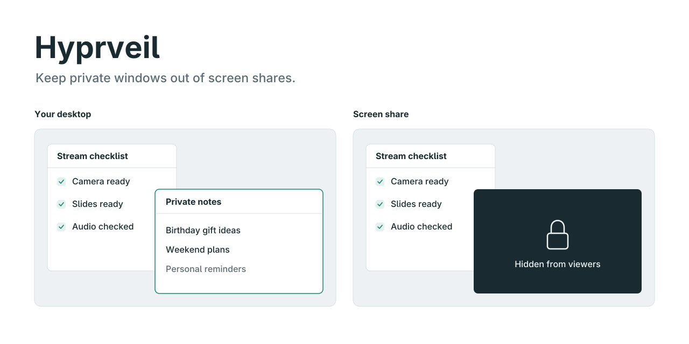
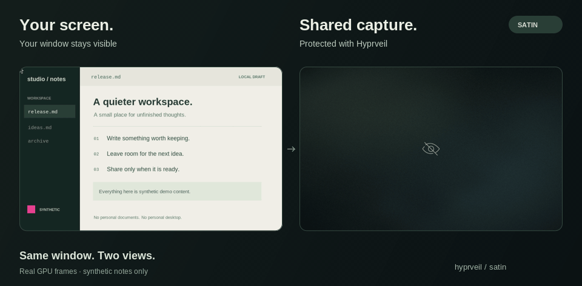
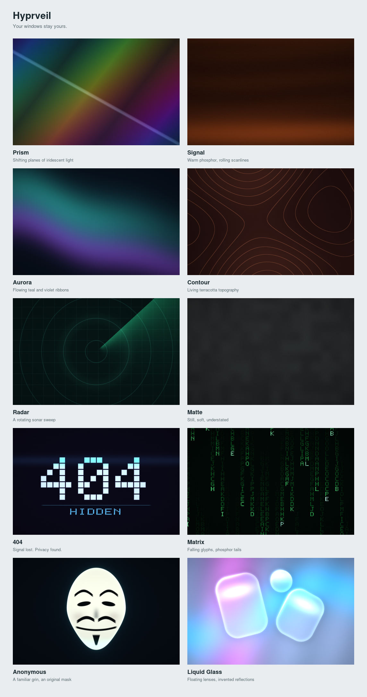
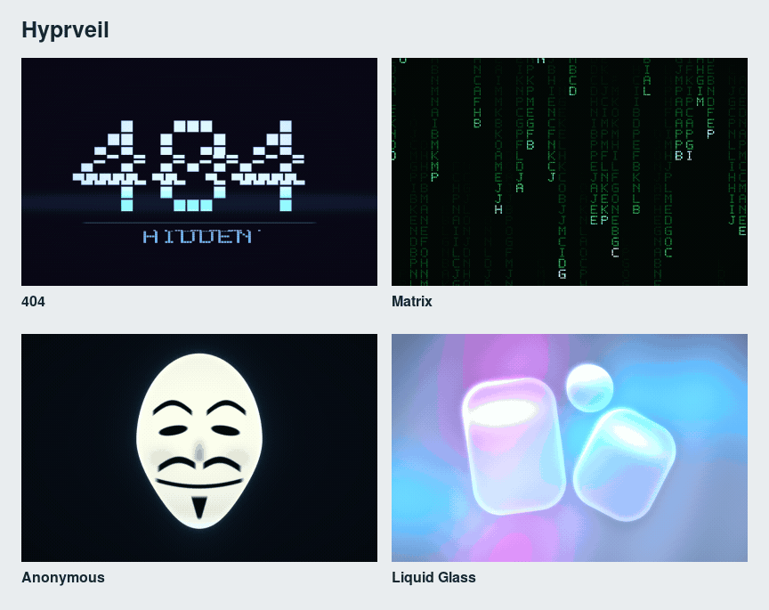

<div align="center">


**Keep your workspace. Choose what you share.**

[](docs/HOST-SETUP.md)
[](https://github.com/OBJLAKO/hyprveil/actions/workflows/tests.yml)
[](LICENSE)

[Install](#install) · [Styles](#choose-your-style) · [Configure](docs/CONFIGURATION.md) · [Omarchy panel](https://github.com/OBJLAKO/omarchy-hyprveil) · [Compatibility](docs/HOST-SETUP.md)
</div>

Private windows stay visible on your desktop while Hyprveil changes what appears in **compositor screen captures**. Omit a window, cover it with black, use an opaque animated design, or supply a PNG. Your windows and layout stay in place.

<div align="center">

<br><sub>Real compositor rendering. All windows and contents in the demo are synthetic.</sub>
</div>

## Install

Hyprveil is a native **hyprpm plugin**. Omarchy is optional. The current compatibility target is **Hyprland 0.56.2 with its reviewed dependency ABI**; other ABIs are refused before hooks are installed.

With [hyprpm's build dependencies](https://wiki.hypr.land/Plugins/Using-Plugins/) and a C++23 compiler, Make, pkg-config, Cairo, zlib and GLES development files available:

```sh
hyprpm add https://github.com/OBJLAKO/hyprveil
hyprpm enable hyprveil
hyprpm reload
```

For autoload, add this to your Hyprland Lua configuration:

```lua
hl.permission("^/usr/(bin|local/bin)/hyprpm$", "plugin", "allow")
hl.on("hyprland.start", function() hl.exec_cmd("hyprpm reload") end)
```

Permission changes take effect on the next login. An interactive permission prompt may appear before then. If you already autoload hyprpm, keep your existing startup entry.

Protect an application with an ordinary window rule:

```lua
hl.window_rule({
  match = { class = "^org[.]example[.]Secret$" },
  no_screen_share = true,
})
```

Or choose an unused key to toggle the focused window:

```lua
hl.bind("SUPER + ALT + H", function()
  local p = hl.plugin.hyprveil
  if p and p.toggle then p.toggle() end
end, { description = "Hide/show focused window in screen sharing" })
```

**Already using the old installer?** Follow the [cold-login migration](docs/HOST-SETUP.md#migrate-from-the-old-installer) before enabling hyprpm. Two competing loaders must not manage the same plugin.

## Choose your style

| Style | Character |
| --- | --- |
| `prism` | Moving angular light facets |
| `signal` | Retro scan lines and a moving sweep |
| `aurora` | Broad, flowing ribbons of light |
| `contour` | Fine topographic curves |
| `radar` | Circular sonar sweep and a crisp grid |
| `matte` | Still mineral texture, without animation |
| `error404` | A bold 404 card with animated broadcast glitches |
| `matrix` | Falling glyphs and bright column heads |
| `anonymous` | A stylized mask with a moving scan glow |
| `glass` | Floating liquid-glass forms and chromatic highlights |





[See all ten styles in motion](assets/styles/motion.gif)

All styles are synthetic and opaque. They never sample protected window pixels.
Choose a clean eye, lock, shield or no icon; adjust its size and opacity. Tint,
grain, darkness and motion speed are native settings. Set speed to zero for
stillness; Matte stays still at every speed. Legacy `satin`, `telegram` and
`grid` names remain accepted as aliases for Prism, Signal and Radar. `404`,
`cmatrix`, `anon` and `liquid-glass` also work as convenient aliases.
Liquid Glass refracts a generated environment, keeping the window underneath
completely private.

```lua
local _, missing = hl.get_config("plugin.hyprveil.mode")
if not missing then
  hl.config({ plugin = { hyprveil = {
    mode = "spoiler",
    variant = "aurora",
    color = "#a7c4d9",
    grain = 35,
    speed = 70,
    darkness = 50,
    eye = true,
    eye_size = 80, -- icon size, retained for compatibility
    icon = "shield",
    icon_opacity = 75,
  } } })
end
```

Use your regular Lua config, or copy the [editable settings example](examples/hyprveil-settings.lua) to `~/.config/hypr/hyprveil-settings.lua` and load it with `dofile`. The panel and optional CLI can save changes to its literal settings block. Without that file, their changes affect the current session and are marked as temporary. See the [complete native configuration reference](docs/CONFIGURATION.md).

## Optional controls

**Omarchy:** add the companion through the regular plugin manager:

```sh
omarchy plugin add https://github.com/OBJLAKO/omarchy-hyprveil.git --enable
```

On first use, its setup action opens an interactive terminal installer, following
the Omarchy Liquid Glass workflow. It installs the reviewed core through
hyprpm and prepares backed-up Lua settings. If the core is already configured,
the panel uses it directly. Its selective loader activates only Hyprveil’s
validated hyprpm artifact, preserving unrelated manually loaded plugins.

The panel includes its own native API client. No separate controller installation is required. Left or middle click toggles focused-window privacy; right click opens the appearance editor. English and Russian are supported.

**CLI:** from a source checkout, optionally run `make install-cli`. This installs a user-local Python client without loading or rebuilding the plugin:

```sh
hyprveil status
hyprveil spoiler
hyprveil configure --variant contour --color '#a7c4d9' --speed 40
hyprveil toggle
hyprveil reset-sharing
```

Native Lua functions and `hyprctl hyprveil status` work without the CLI. hyprpm owns module installation, loading and updates.

## Updates and compatibility

```sh
hyprpm update
hyprpm reload
```

Stop active screen sharing before updating/reloading native plugins. While the
module is unloaded, captures use Hyprland's native renderer; third-party FX can
have their own masking limits. The current module preserves mapped inherited
privacy as native window properties before teardown.

The native module and build probe both enforce the reviewed ABI. A supported release is pinned to a reviewed source commit in `hyprpm.toml`. New compositor releases need a compatibility review and the synthetic rendering suite; changing a version label does not establish support.

Unloading revokes temporary sharing and transfers inherited window privacy to native `no_screen_share` properties. The native fallback uses black replacement. Those protective properties can remain after reload until an explicit window privacy action changes them.

## Know the boundary

Hyprveil covers compositor-mediated capture. **Direct KMS/DRM recording bypasses it.** It cannot retract frames already delivered to another application, protect against an equally privileged native plugin, or guarantee every driver and capture client. Protected direct-window captures, locking, unsupported output transforms and rendering failure use black replacement.

Read the [security scope](SECURITY.md), [technical review](docs/REVIEW.md), and [validation matrix](docs/VALIDATION.md). Tests use disposable compositors and synthetic content; a successful command is never treated as evidence of pixel privacy.

## Development

```sh
make
python3 -m unittest discover -s tests -p 'test_*.py'
make test-session-guard test-png-guard test-privacy-policy \
     test-spoiler-pattern test-appearance test-native-config
```

[Testing guide](docs/TESTING.md) · [Contributing](CONTRIBUTING.md) · [MIT license](LICENSE)

Created by [OBJLAKO](https://github.com/OBJLAKO). Synthetic reproductions and compatibility reports help make Hyprveil useful on more desktops.
